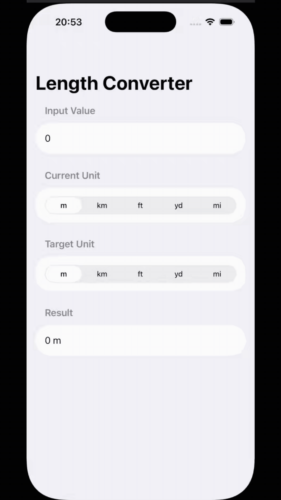

# Challenge Day - Unit Converter
## Description
This project is the consolidation challenge from Day 19 of the "100 Days of SwiftUI" course (https://www.hackingwithswift.com/100/swiftui/19).

The goal was to build a unit conversion application from scratch. This app focuses specifically on Length Conversion. The user can input a value, select an input unit (m, km, ft, yd, mi), and select an output unit. The app uses Apple's Measurement framework to perform the conversion accurately and display the result.
## Key Features Implemented
**Input:** Uses a TextField restricted to a decimal keyboard (.decimalPad) for numerical input.

**Unit Selection:** Uses segmented Picker controls for selecting both the input and output units.

**Conversion Logic:** A computed property (convertedValue) uses the Measurement and UnitLength types to handle all conversion logic safely and accurately.

**Keyboard Handling:** Uses @FocusState to track the text field's focus and provide a "Done" button in the toolbar to dismiss the keyboard.
## Demo

  

